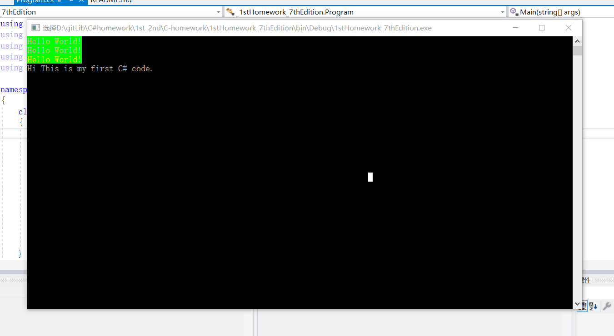

# C#Homework
### 一：
简易修改老师的代码后试图将其push到我自己的远程作业库中，自行找到了设置里面的编辑远程库，勾掉推送与提取匹配后依然无法成功push至自己的库，于是打算新建一个项目直接clone自己的作业库进行操作。
### 二：
##### 1、
我尝试在clone了自己的库后往里面添加新的项目，左上角的新建每次都是彻底新建全新的项目（当时并没有发现可以把“创建新的解决方案”换成“添加至已有的解决方案”）。于是我就尝试从右边解决方案资源管理器中右键添加新的项目进去。
一开始我选择添加文件，因为codeblocks上写c++时直接新建文件就可以了。后来发现文件无法调试，我改去添加新项。
##### 2、
但是添加新项不知道该加什么，就看着老师的文件的小图标，一个一个对比发现一致后选择相符的，新建后还是无法成功调试。
### 三：
###### 1.1、
我重新开始在左上角 文件-新建 中寻找，终于发现了“添加到解决方案”这个选项，然后开始从这里尝试创建新的项目。
但是我忘了老师说的该创建什么项目了，于是一开始直接新建了Windows空白应用，然后发现写好代码后并不能正常运行。
于是我删除后直接新建试图运行默认生成的默认基本空白的代码但还是不行。
###### 1.2、
我去了老师办公室，向助教询问，助教学长学姐说自己一般用命令行的git，于是他们教会了我如何
运用命令行连接远程库，修改本地库以及同步等操作，还教会了我如何只同步单独的几个文件。然后我就去吃晚饭，打算接下来的回宿舍再弄。
###### 2.1、
我进入了微软官网，查看VS的C#教程，发现里面教的“编译你的第一个C#应用HelloWorld”，里面说要新建
.NET Core(Console应用)，我十分激动
###### 2.2、
我真的特别激动！我终于能写出hello world了！然后我按官网教程新建、输入、编译，还是失败了。
截至现在我已经从中午14点折腾到晚上18：30了。我连第一个Hello World都没写出来！
### 四：
我心态崩了，开始去微信群里询问老师，终于在老师一点一点的耐心教学下，我学会了如何完成第一项作业。我真的激动！为什么这么难

